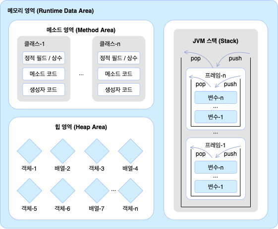

<details>
  <summary>애플리케이션 개발 원칙</summary>

## 애플리케이션 개발 원칙
> SOLID 원칙을 지킨다<br>
하나의 책임만<br>
추상화에 의존<br>
확장에만 열려있도록<br>

</details>

<details>
  <summary>JVM, Static</summary>

## JVM의 메모리 구조

- Heap: 객체 인스턴스 저장
- Method Area(or Class Area): 클래스(메타데이터), 스태틱 변수, 스태틱 메서드 등이 저장
- Stack: 메서드 호출 시 각 스레드마다 생성되는 스택 프레임이 저장

스태틱 변수와 메서드가 별도의 메서드 영역에 존재하므로<br> 해당 클래스의 인스턴스를 new 생성자로 만들지 않아도 사용할 수 있다<br>
내부 스태틱 클래스도 외부클래스와 독립적으로 메서드 영역에 존재한다
```java
public class OuterClass {

    private int instanceVariable = 1;
    private static int staticVariable = 2;

    public static class StaticNestedClass {
        public void printVariables() {
            // System.out.println(instanceVariable); // 컴파일 에러: 스태틱 클래스는 외부 클래스의 인스턴스 변수에 접근할 수 없음
            System.out.println(staticVariable); // 스태틱 변수에는 접근 가능
        }
    }

    public static void main(String[] args) {
        // 외부 클래스의 인스턴스 생성 없이 스태틱 클래스의 인스턴스를 생성할 수 있음
        OuterClass.StaticNestedClass nestedInstance = new OuterClass.StaticNestedClass();
        nestedInstance.printVariables(); // 출력: 2
    }
}
```
</details>

# [Spring Framework](docs/springframework.md)

## [Servlet Container](docs/servlet-container.md)

## [ApplicationContext](docs/applicationcontext.md)

## [BeanFactory](docs/beanfactory.md)

## [BeanDefinition](docs/beandefinition.md)

## [@Configuration](docs/configuration.md)

## [@ComponentScan](docs/componentscan.md)

## [@Autowired](docs/autowired.md)

## [@Autowired Option](docs/autowiredoption.md)

## [@Quilifier, @Primary](docs/quilifier.md)

