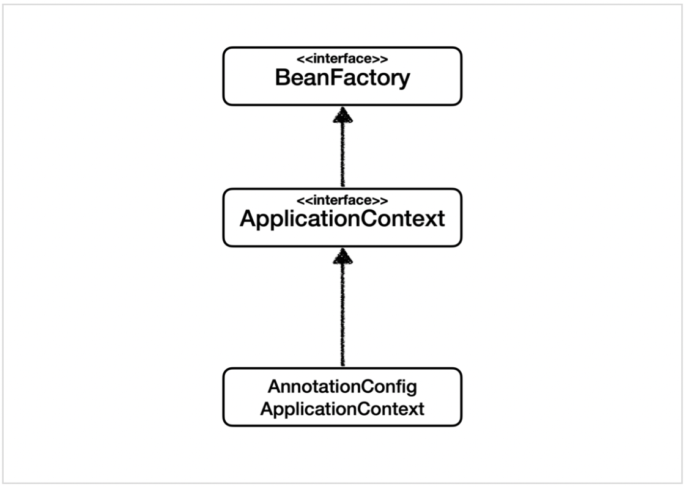

# ApplicationContext

애플리케이션의 설정 정보를 제공한다<br>
스프링 애플리케이션에서 빈(Bean)을 생성하고 관리하는 핵심 인터페이스<br>
ApplicationContext는 스프링 IoC(Inversion of Control) 컨테이너의 고급 형태이다

Context는 특정 작업이나 환경에 대한 설정 정보, 상태, 리소스 등을 관리하는 객체를 의미한다

> 주요기능

- 빈 팩토리 (Bean Factory) -
  빈은 스프링 컨테이너에 의해 생성되고 관리된다
- 애플리케이션 이벤트를 리스너로 처리
- 메세지 소스
- 환경 변수 -
  외부 설정 파일이나 시스템 환경 변수에 접근해 애플리케이션의 환경 설정 정보를 제공한다
- 리소스 로딩  - 파일 시스템, 클래스패스, 리소스

> 구현 클래스
### GenericXmlApplicationContext
일반적인 XML 기반 애플리케이션 컨텍스트
```java
GenericXmlApplicationContext context = new GenericXmlApplicationContext();
context.load("classpath:beans.xml");
context.load("file:/path/to/another-beans.xml");  // 파일 시스템에서 XML 파일 로드
context.refresh();  // 컨텍스트 초기화
```
### AnnotationConfigApplicationContext
자바 애노테이션을 사용하여 구성 클래스를 통해 컨텍스트를 로드
```java
ApplicationContext context = new AnnotationConfigApplicationContext(AppConfig.class);
```
### WebApplicationContext
웹 애플리케이션에서 사용되며, 서블릿 컨텍스트와 통합, 웹 MVC에서 주로 사용
```java
@Configuration
public class AppConfig {
    @Bean
    public MyService myService() {
        return new MyServiceImpl(); // 구현 클래스는 별도로 구성
    }
}
```
```java
public class Main {
    public static void main(String[] args) {
        ApplicationContext context = new AnnotationConfigApplicationContext(AppConfig.class);
        MyService myService = context.getBean(MyService.class);
        myService.perform(); // 구현 클래스의 메서드 호출
    }
}

```

[Back to main README](../README.md)