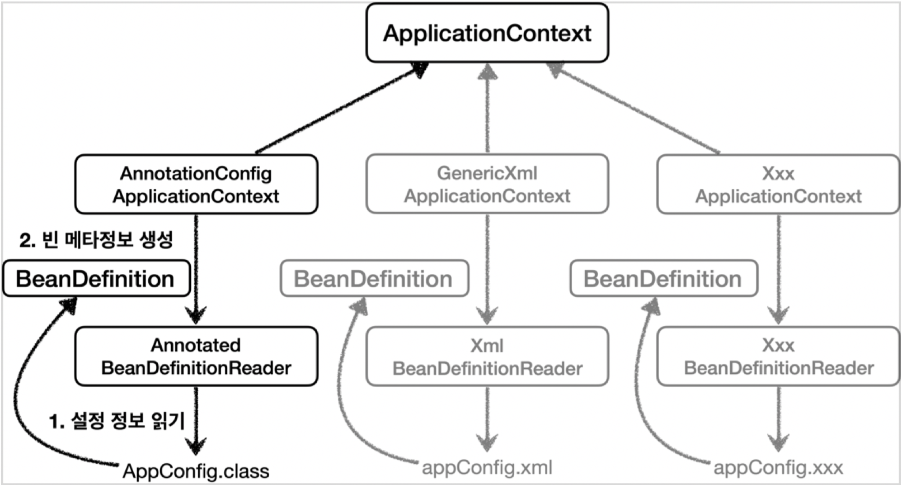

## BeanDefinition

IoC컨테이너가 관리하는 객체를 정의하는 메타데이터 
스프링은 xml파일, 자바 설정 클래스, 자바 어노테이션으로 `BeanDefinition`을 정의한다 
스프링 컨테이너는 `BeanDefinition`만 보고 빈 생성, 설정, 생명주기를 관리한다 
스프링은 `BeanDefinition`인터페이스를 구현하여 다양한 빈 객체를 관리한다

스프링의 `ApplicationContext`인터페이스는 멤벼 변수로 `BeanDefinitionReader`인터페이스를 가지고 있다. 
이 인터페이스를 통해 xml, 어노테이션, 클래스등에서 빈 정의를 읽고 `BeanDefinition`인터페이스를 정의한다

[Back to main README](../README.md)