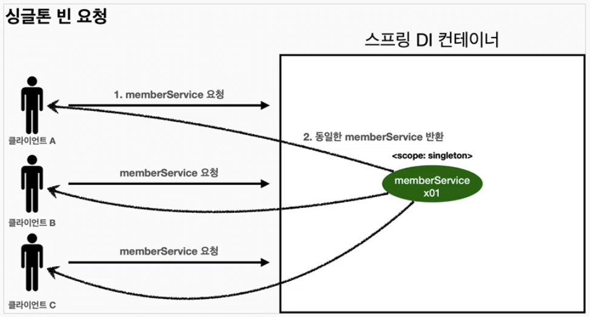

## Bean scope
빈의 생명 주기를 정의한다

> 주요 빈 스코프

- 싱글톤 스코프 (singleton)
- 프로토타입 스코프 (prototype)
- 요청 스코프 (request)
- 세션 스코프 (session)
- 애플리케이션 스코프 (application)
- 웹 소켓 스코프 (websocket)

### 싱글톤 스코프
별도로 지정하지 않으면 기본적으로 싱글톤 스코프로 컨테이너 시작과 종료까지 유지된다

- 생명 주기: 애플리케이션 컨텍스트당 하나의 인스턴스만 생성된다
- 용도: 상태를 공유해야 하거나, 비용이 많이 드는 객체를 생성할 때 유용<br>
```java
import org.springframework.stereotype.Component;

@Component
public class SingletonBean {
    // ...
}
```
### 프로토타입 스코프
- 생명주기: 빈 요청 시마다 새로운 인스턴스가 생성된다<br>
  빈은 초기화 시점에 초기화 되지 않고 사용하기 직전에 초기화 된다<br>
  스프링 컨테이너는 생성한 빈을 반환하고 더 이상 관여하지 않는다
- 용도: 상태를 공유하지 않고 매번 새로운 객체가 필요할 때<br>
```java
import org.springframework.context.annotation.Scope;
import org.springframework.stereotype.Component;

@Component
@Scope("prototype")
public class PrototypeBean {
    // ...
}
```

### 요청 스코프
- 생명 주기: HTTP 요청당 하나의 인스턴스가 생성된다
- 용도: 웹 애플리케이션에서 요청당 별도의 빈 인스턴스가 필요할 때
```java
import org.springframework.context.annotation.Scope;
import org.springframework.stereotype.Component;
import org.springframework.web.context.annotation.RequestScope;

@Component
@RequestScope
public class RequestBean {
    // ...
}
```
### 세션 스코프
- 생명 주기: HTTP 세션당 하나의 인스턴스가 생성된다
- 용도: 웹 애플리케이션에서 사용자 세션 동안 상태를 유지해야 할 때
```java
import org.springframework.context.annotation.Scope;
import org.springframework.stereotype.Component;
import org.springframework.web.context.annotation.SessionScope;

@Component
@SessionScope
public class SessionBean {
    // ...
}
```
### 애플리케이션 스코프
- 생명 주기: 서블릿 컨텍스트당 하나의 인스턴스가 생성된다
- 용도: 웹 애플리케이션 전체에서 공유해야 하는 객체가 필요할 때
```java
import org.springframework.context.annotation.Scope;
import org.springframework.stereotype.Component;
import org.springframework.web.context.annotation.ApplicationScope;

@Component
@ApplicationScope
public class ApplicationBean {
    // ...
}
```

### 웹 소켓 스코프
- 생명 주기: 웹 소켓 세션당 하나의 인스턴스가 생성된다
- 용도: 웹 소켓 통신에서 세션 동안 상태를 유지해야 할 때
```java
import org.springframework.context.annotation.Scope;
import org.springframework.stereotype.Component;
import org.springframework.web.socket.WebSocketSession;
import org.springframework.web.socket.config.annotation.EnableWebSocket;
import org.springframework.web.socket.handler.TextWebSocketHandler;

@Component
@Scope("websocket")
public class WebSocketBean extends TextWebSocketHandler {
    // ...
}
```

### 싱글톤 빈에서 프로토타입 빈을 호출할 때
최초 싱글톤 빈에 프로토타입 빈을 생성헤 주입하면 싱글톤 빈은 해당 프로토타입 인스턴스를 멤버 변수로 가지고 있는다<br>
이때 여러 스레드에서 프로토타입의 상태값을 변경하는 메서드를 호출하면 상태값을 여러 스레드가 공유하게 된다

사용자마다 값을 공유하지 않으려면 프로토타입 빈을 멤버변수로 주입하지 말고 메서드의 로컬변수로 주입해야한다


[Back to main README](../README.md)