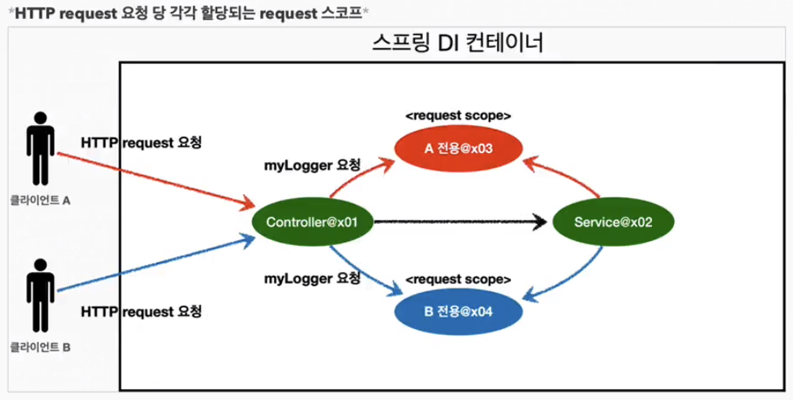

## request scope

스프링 웹 기술을 사용하기 위해 web 라이브러리 추가
```
    implementation 'org.springframework.boot:spring-boot-starter-web'
```
추가 후 실행하게 되면 콘솔에 아래 라인 추가된다
```java
 o.s.b.w.embedded.tomcat.TomcatWebServer  : Tomcat initialized with port(s): 8081 (http)
 o.a.catalina.core.AprLifecycleListener   : Loaded Apache Tomcat Native library [1.2.35] using APR version [1.7.0].
 o.a.catalina.core.AprLifecycleListener   : APR capabilities: IPv6 [true], sendfile [true], accept filters [false], random [true], UDS [true].
 o.a.catalina.core.AprLifecycleListener   : APR/OpenSSL configuration: useAprConnector [false], useOpenSSL [true]
 o.a.catalina.core.AprLifecycleListener   : OpenSSL successfully initialized [OpenSSL 1.1.1q  5 Jul 2022]
 o.apache.catalina.core.StandardService   : Starting service [Tomcat]
 org.apache.catalina.core.StandardEngine  : Starting Servlet engine: [Apache Tomcat/9.0.71]
 o.a.c.c.C.[Tomcat].[localhost].[/]       : Initializing Spring embedded WebApplicationContext
 w.s.c.ServletWebServerApplicationContext : Root WebApplicationContext: initialization completed in 532 ms
 o.s.b.w.embedded.tomcat.TomcatWebServer  : Tomcat started on port(s): 8081 (http) with context path ''
```
라인 순서대로 설명하면
- 내장된 Tomcat 서버가 HTTP 포트 8081에서 초기화
- Apache Tomcat Native 라이브러리(버전 1.2.35)가 APR(Apache Portable Runtime) 버전 1.7.0을 사용하여 로드
- APR의 다양한 기능들이 지원
- APR/OpenSSL 구성
- OpenSSL 초기화
- Tomcat 서비스 시작
- 서블릿 엔진 시작
- Spring WebApplicationContext 초기화
- Root WebApplicationContext 초기화 완료
- Tomcat 서버 시작 완료

### request scope bean
reqest 생명주기를 가지는 빈으로 각 사용자 요청마다 다른 스레드에서 독립적인 인스턴스를 가진다

```java
@Component
@Scope(value = "request")
public class MyLogger {

    private String uuid;
    private String requsetUrl;

    public void setRequsetUrl(String requsetUrl) { // url은 Lazy Loading시점에 빈이 생성되면 나중에 넣는다
        this.requsetUrl = requsetUrl;
    }

    public void log(String msg) {
        System.out.println("["+uuid+"]"+"["+requsetUrl+"]"+" msg = " + msg);
    }

    @PostConstruct
    public void init() {
        uuid = UUID.randomUUID().toString();
    }

    @PreDestroy
    public void close() {
        System.out.println("["+uuid+"]"+" MyLogger.close");
    }
}
```
```java
@Controller
@RequiredArgsConstructor
public class WebController {

    private final LogService logService;
    private final ObjectProvider<MyLogger> myLoggersProvider;

    @GetMapping("/request-scope")
    @ResponseBody
    public String requestScope(HttpServletRequest request) {
        MyLogger myLogger = myLoggersProvider.getObject();
        myLogger.setRequsetUrl(request.getRequestURI().toString());

        myLogger.log("controller test");
        logService.logic("testId");
        return "OK";
    }
}
```
웹 애플리케이션 실행시점에는 스프링 컨테이너에 MyLogger 빈이 생성되지 않으므로 Provider로 실제 사용시점에 주입한다<br>
브라우저에서 요청을 보내면 콘솔에 동일한 UUID가 출려된다 (동일한 빈)
```
[b1cc7cfc-21fe-4b15-b5db-638d97305764][/request-scope] msg = controller test
[b1cc7cfc-21fe-4b15-b5db-638d97305764] MyLogger.close
```

### Proxy + request scope bean
스프링에서는 프록시를 사용하여 요청 스코프 빈을 감싸서,<br>
싱글톤 빈에서 사용할 때 각 요청마다 새로운 인스턴스를 사용할 수 있다<br>

웹 애플리케이션 실행시점에는 가짜 프록시 빈을 주입해두고 실제 사용할 때 교체한다
```java
@Component
@Scope(value = "request", proxyMode = ScopedProxyMode.TARGET_CLASS)
// 또는 @RequestScope(proxyMode = ScopedProxyMode.TARGET_CLASS)
public class MyLogger {
    // ...
}
```
```java
@Controller
@RequiredArgsConstructor
public class WebController {

    private final LogService logService;
    private final MyLogger myLogger;

    @GetMapping("/request-scope")
    @ResponseBody
    public String requestScope(HttpServletRequest request) {
        System.out.println("proxy mylogger = "+myLogger.getClass());
        myLogger.setRequsetUrl(request.getRequestURI().toString());

        myLogger.log("controller test");
        logService.logic("testId");
        return "OK";
    }
}
```
콘솔을 확인해 보면 스프링이 처음에는 CGLIB라이브러리로 `MyLogger`를 상속한 가짜 프록시 객체를 주입해두었고<br>
실제 사용 시 빈을 변경한다
```
proxy mylogger = class hello.core.scope.MyLogger$$EnhancerBySpringCGLIB$$b92c8f99
[090684db-87cd-4a90-8563-120b16b49828][/request-scope] msg = controller test
[090684db-87cd-4a90-8563-120b16b49828] MyLogger.close hello.core.scope.MyLogger@34ca4bee
```
이런 프록시 객체를 사용하면 코드 변경을 최소화할 수 있는 장점이 있다

[Back to main README](../README.md)