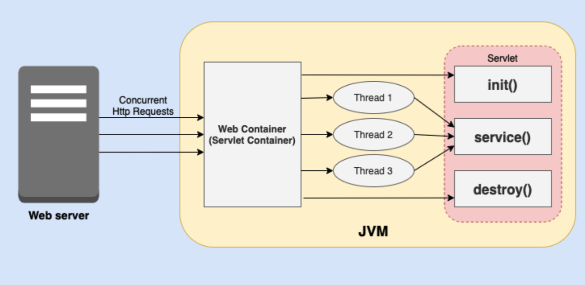

## 서블릿 컨테이너(Servlet Container)

서블릿을 실행하고 관리하는 자바 엔터프라이즈 환경의 구성 요소 (Apache Tomcat, Jetty, WildFly, GlassFish)
>주요 기능
>
- 라이플 사이플 관리 (초기화-서비스-소멸) -
  컨테이너는 서블릿 클래스의 인스턴스를 생성하고, 초기화 메서드를 호출하여 서블릿을 초기화
- 요청 및 응답 처리 - 요청 > 서블릿 > 응답, HttpServletRequest, HttpServletResponse 생성 및 관리
- 웹 애플리케이션 배포 - WAR(Web Application Archive) 파일로 패키징되어 배포
- 서블릿 컨텍스트 관리 - 서블릿 컨테이너는 ServletContext 객체를 생성하고 관리, 애플리케이션 내의 서블릿들은 ServletContext를 통해 서로 데이터를 공유
- 세션 관리 - HttpSession로 클라이언트의 상태를 저장
- 보안 관리
> 동작 방식

1. 배포될 때 서블릿 컨테이너는 web.xml 파일이나 애노테이션을 통해 서블릿을 구성하고 초기화<br>
2. HTTP 요청이 들어오면 서블릿 컨테이너는 적절한 서블릿 선택<br>
3. 요청 객체(HttpServletRequest)와 응답 객체(HttpServletResponse)를 생성하고, 서블릿의 service() 메서드를 호출<br>
4. 서블릿이 필요하지 않으면 destroy() 메서드 호출
```java
import java.io.IOException;
import javax.servlet.ServletException;
import javax.servlet.http.HttpServlet;
import javax.servlet.http.HttpServletRequest;
import javax.servlet.http.HttpServletResponse;

@WebServlet("/hello")
public class HelloServlet extends HttpServlet {
    @Override
    protected void doGet(HttpServletRequest request, HttpServletResponse response)
            throws ServletException, IOException {
        response.setContentType("text/html");
        response.getWriter().println("<h1>Hello, World!</h1>");
    }
}
```

[Back to main README](../README.md)